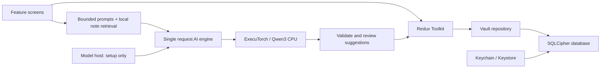

# Saathi

A private daily companion built with React Native, Expo and **react-native-executorch 0.10.2**. Capture a thought, review suggested action items, and give your day a manageable plan.

## What works in this first version

- Notes: create, edit, delete, search and organize into Personal, Work or Ideas.
- Planner: add/edit tasks, priorities, dates, completion and overdue filtering.
- AI task extraction: a real native ExecuTorch integration, strict JSON validation, editable suggestions and explicit save.
- Ask your notes: local keyword retrieval selects up to four supporting notes for the model. Sources are visible. This is **keyword retrieval**, not semantic search.
- Daily planning from open tasks and short text rewriting, with streaming responses and cancellation.
- English/Hinglish AI preference, system/light/dark appearance, accessible controls and tablet width constraints.
- Native SQLCipher encrypted storage with a random key held by SecureStore. Browser preview uses unencrypted localStorage and says so in the interface.

No account, API key, cloud inference or subscription is required. Notes and manual tasks work before model setup. The first model download requires internet; cached model requests are designed to work offline.

## Run locally

Use Node 24 LTS, npm, and Xcode/CocoaPods for iOS or the Android SDK/JDK for Android.

```sh
npm ci
npm run ios
# or, with Android tooling available
npm run android
```

These commands generate the native projects and build a development client. **Expo Go is unsupported**: both ExecuTorch and SQLCipher require the native build.

If a native development client is already installed:

```sh
npm start
```

For a browser UI preview:

```sh
npm run web
```

The preview can save notes and tasks in this browser. AI is explicitly unavailable on web; it does not return simulated answers.

### First AI request

1. In the native app, open **Settings → Download / load private AI**.
2. Allow roughly 0.5–0.8 GB for the quantized Qwen3 model and tokenizer; exact upstream artifact size can vary. Keep at least 2 GB storage free as development headroom. Test on phones with 4 GB+ RAM; this is a starting recommendation, not a measured guarantee.
3. Save a note such as: “Tomorrow send the project update. Buy groceries. My project review is on Friday.”
4. Open the note, choose **Find action items**, review titles/dates/priorities, then save the selected tasks.
5. Open **Saathi AI → Ask my notes** and ask about “project review”. Or choose **Plan my day** once tasks exist.

Setup is opt-in on each app launch; subsequent setup resolves cached files. It does not intentionally redownload existing model weights. Generation starts a fresh session per request and disposes it afterward, trading some loading latency for bounded memory and no lingering conversation context.

## Verified here

- TypeScript strict checks.
- 16 automated tests for dates, persisted schema validation, task ordering, output parsing, note retrieval, cancellation, concurrency and safe native disposal.
- Expo SDK dependency compatibility check.
- Production web export.
- iOS development build compiled and installed successfully on an iPhone 17 Pro simulator, with the iOS JS bundle produced by Metro.

Native model download/inference, native vault runtime behavior and mobile UI interaction **have not been end-to-end verified**. Simulator UI access was not permitted in this session. The Android SDK was not available, so an Android build has not been run. Treat the app as a working implementation that still needs device acceptance testing, not a store-ready release.

## Architecture

```text
src/
  domain/             Zod schemas, limits, calendar logic, task ordering
  data/               Native encrypted repository + browser adapter
  store/              Redux Toolkit state and ordered persistence queue
  features/
    home/             Daily overview
    notes/            Notebook and thought editor
    tasks/            Planner and task editor
    ai/               Prompts, retrieval, output parser and native lifecycle
    settings/         Model setup, preferences and local data controls
  ui/                 Theme, accessible primitives and date refresh
```



Redux Toolkit manages serializable notes/tasks/preferences. Native sessions, AbortControllers and downloaded resource handles stay outside Redux. A sequential write queue prevents older saves from overwriting newer changes and exposes failures with a retry path. Saga/React Query would add little value to this local, single-request workflow; introduce them when actual asynchronous orchestration or server state appears.

The initial repository stores a versioned bounded snapshot (500 notes / 1,000 tasks) in one encrypted SQLite row. For larger datasets, migrate to normalized tables, incremental writes and SQLite FTS. The repository boundary keeps that change out of feature screens.

## Checks and release preparation

```sh
npm run check
npx expo install --check
npx expo export --platform web
```

GitHub Actions runs type checks, tests, formatting and the browser build. `eas.json` contains development, internal preview and production profiles. Before EAS distribution, set your real application identifiers, configure signing and link your own Expo project. No deployment or external publishing was performed.

Keep development and production application identifiers separate before real distribution. Regenerate native projects through Expo prebuild after changing native dependencies/plugins. Run the native build checks on both platforms in CI before store releases. Review App Store encryption/export-compliance requirements for the SQLCipher build; the app config declares non-exempt encryption instead of claiming an exemption.

## Limits and next improvements

- **Performance:** profile first-token latency, peak RAM, battery and thermals on real low/mid/high-end phones. The model releases memory after each request; token UI updates are throttled. Only XNNPACK is downloaded/linked. Consider a retained session or hardware acceleration after measuring device behavior.
- **Security:** no note upload or application analytics. ExecuTorch download telemetry is disabled. Android backup is disabled; iOS encrypted data and key backup behavior requires a release test. Add an opt-in biometric lock and a deliberate encrypted export/recovery flow before treating the app as a long-term personal vault.
- **Quality:** validate model output, keep task mutations behind review, cap context and fail explicitly. Add data migrations, component tests and a real navigation stack as scope grows. The Xcode toolchain's transitive `uuid` is overridden to a patched CommonJS-compatible 11.1.1; the tooling compatibility check is documented in `docs/RESEARCH.md`.
- **Testing:** run the acceptance checklist in `docs/DEVICE-TESTS.md`, especially airplane-mode use, failed downloads, background cancellation, disk-full writes, process restarts and screen-reader/font scaling.
- **Product:** notifications, voice transcription, OCR, cloud sync, semantic retrieval and backup export are not implemented. Tasks are planner entries; the app does not schedule reminder notifications. Hinglish is an AI response preference, not a fully localized interface.

See [research and version decisions](docs/RESEARCH.md) for the official sources and tradeoffs.
