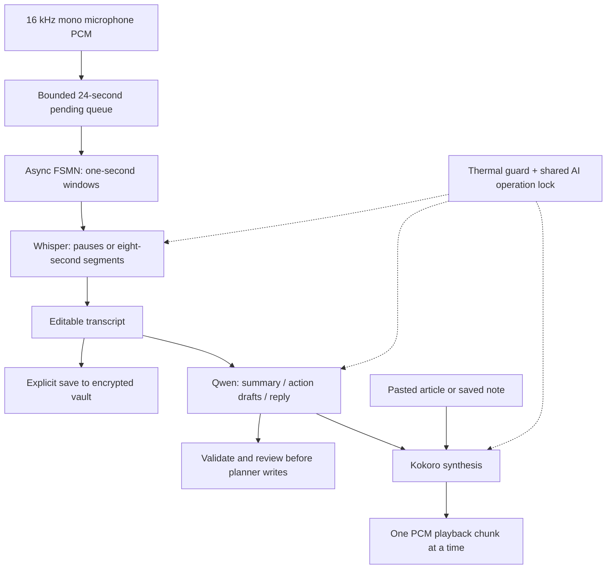

# Offline voice — features 15–20

Open **Saathi AI → Voice studio**. In **Settings → Voice notes & read-aloud**, load the speech pack for capture/dictation/VAD, and an English or Hindi voice for read-aloud. Summaries need the existing text AI model; voice assistant needs all three stages for its selected language. Downloads are explicit and cached; setup after restart reuses files.

Whisper Tiny multilingual uses XNNPACK FP32 with FSMN VAD. Kokoro XNNPACK uses one voice per language (`af_heart` / `hf_alpha`). Hindi output expects Devanagari; the voice assistant requests that script rather than Roman-script Hinglish. Language accuracy needs physical-device evaluation.

## Architecture and limits

- `VoiceController` orchestrates outside React. PCM, native handles and stream updates stay outside Redux; reviewed transcripts and summaries enter SQLCipher through the existing serial persistence queue.
- `LocalAIEngine.runOperation` holds one execution slot across text and voice, registers cancellation and records health phases. It waits for native calls to settle before disposal. Speech resources are freed before the LLM, and the LLM is freed before TTS.
- `react-native-audio-api@0.13.3` captures/plays PCM through its public API. Its entry point imports gesture-handler/reanimated controls, requiring their Expo-compatible dependencies even when custom controls are used.
- The Expo plugin configures mic permission; background audio and foreground services are disabled. FFmpeg and extra static codecs are disabled: this batch does not import media files. ExecuTorch `phonemis` is enabled for Kokoro.
- Capture validates the actual 16 kHz mono format and copies native buffers before async use. Unsupported audio routes fail visibly. Async VAD/transcription run through ExecuTorch worklets.
- The pending queue caps at 24 seconds (~1.5 MB PCM), plus roughly nine seconds in the active segment. Overflow stops capture with an error and drains accepted audio for review. Input level UI follows ~100 ms buffers; no fabricated waveform/sensor values are used.
- Dictation finalizes at pauses or roughly eight seconds of voiced audio, plus inference time. It is chunked live dictation, not guaranteed word-level real-time recognition. Boundary accuracy can vary. VAD labels refer to the last processed window and may lag capture.
- Clips cap at ten minutes (one minute for voice questions), with a wall-clock watchdog. No raw audio file is saved or uploaded; transcripts cannot replay the original recording. Detection-only mode loads VAD without Whisper.
- Transcripts cap at 24,000 characters, history at 50. Additive Zod defaults migrate old snapshots. Summaries process the entire transcript in chunks; invalid JSON/fields never become planner mutations. All suggested actions start unselected. Editing transcript text invalidates its previous summary/actions.
- Read-aloud splits text and plays one generated chunk at a time. Stop, audio interruptions and removed headphones cancel playback. The mic closes before a reply to avoid self-recording. There is no wake word or background listener.
- Thermal/background cancellation retains already completed transcript text for review and discards incomplete inference. Explicit vault erasure clears voice drafts after active work settles. Save errors retain the existing retry banner. Process termination can lose unsaved in-memory text.

## Verification and physical acceptance

Unit tests mock audio/models: they check ordering/final tails, queue overflow, waiting-reader cancellation, setup opt-in, voice/text exclusion, VAD-only mode, interrupted capture, safe load/inference cancellation, disposal order, snapshot migration, full transcript coverage and malformed summary output. They do not establish speech accuracy or real-device thermal behavior.

The voice-enabled iOS development build compiled successfully and installed on the iPhone 17 Pro simulator (0 errors, one Expo build-script warning). Android/iOS/web production JavaScript exports passed. Browser capture/read-aloud UI was inspected; actual model inference and physical microphone tests remain pending. Android native compilation still requires the Android SDK.

1. Deny microphone permission, grant it from Settings, and retry. Confirm the OS mic indicator clears on finish, cancel, background, lock, call interruption and disconnected headphones.
2. Record known English/Hindi/mixed-language samples in quiet and noise. Verify first/last words, pauses, names, dates, numbers and silence; VAD/transcription can miss speech or hallucinate.
3. Download packs, restart and load from cache in airplane mode. Exercise failed/partial downloads and storage exhaustion.
4. Run a ten-minute clip on a lower-memory phone; check queue lag, memory, thermals and cancellation. No thermal warning is not proof of no device impact.
5. Summarize a known meeting spanning multiple chunks, inspect every decision/action/date, add only selected tasks once, and restart to verify encrypted history.
6. Read long English/Devanagari text at each speed. Cancel during loading, synthesis and playback. Verify no overlapping mic/audio and that model memory is released.
7. Check narrow screens, dark mode, large fonts, VoiceOver/TalkBack, tab changes and the Health stop action during voice work.

A new native build is required after dependency/plugin changes. If CocoaPods reports an unaccepted Xcode license, review it with `sudo xcodebuild -license` before `npm run ios`. Android needs an SDK/JDK. Platform JavaScript exports do not prove native compilation or runtime model compatibility.

## Primary references

- [ExecuTorch STT](https://docs.swmansion.com/react-native-executorch/docs/extensions/speech-to-text), [TTS](https://docs.swmansion.com/react-native-executorch/docs/extensions/text-to-speech), [VAD](https://docs.swmansion.com/react-native-executorch/docs/extensions/voice-activity-detection)
- [Audio API recorder](https://docs.swmansion.com/react-native-audio-api/docs/inputs/audio-recorder/), [Expo plugin](https://docs.swmansion.com/react-native-audio-api/docs/other/audio-api-plugin/)

The installed ExecuTorch 0.10.2 and Audio API 0.13.3 source/type definitions are the exact API contract used here. Website compatibility tables can lag releases; physical native builds remain a release gate.
